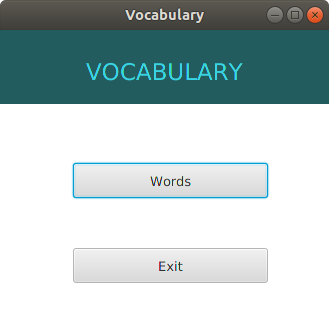

# Vocabulary
This is the first version of "Vocabulary".
Sorry for the lack of design, someday it will appear :)

And here's an example of how it works:

+ Main window 

+ Words window

What's in the next version:
+ When deleting a word from "All words" (section), then it will be deleted from the rest of the sections; (+)
+ The first exercise will appear (5 words);
+ When adding a word to any section (not "All words"), it will be automatically added to "All words";(+)
+ The ability to add one word several times will be removed;(+)
+ When you change a word, it will change in all sections in which it is located;(+) 
+ Bug fixes;(+?)
+ First design? But it’s not certain:)
